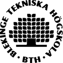

---
title: "Om | maaa16"
...

Studenten och Commentary
=========================

Jag, studenten bakom det hela, heter Magnus Andersson (magnusandersson076@gmail.com).

###Commentary för Anax

Det är en fråga/svara modul som i både utformning och stil är rätt så lik Stackoverflow. Med Frågor, svar och kommentarer som även kan röstas både uppåt och nedåt. Användaren har en vissa aktivitetspoäng och en rang. Det bygger även på etiketter. Varje fråga måste minst ha en etikett.

Aktivitetspoängen får man när man ställer frågor, svarar eller kommenterar.

Aktivitetspoäng:

- Varje fråga ger 1,5 p
- Varje svar ger 1,0 p
- Varje kommenter ger 0,5 p

Rangpoäng beror på röstningssumman av frågor, svar och kommentarer. Man kan således ha negativt antal rangpoäng.

Rangpoäng:

- Röstsumman av en fråga * 5 p
- Röstsumman av ett svar * 10 p
- Röstsumman av en kommentar * 1 p
- För varje svar som är accepterat 15 p

###Github - RVIProject
Koden finner man på Github under namnet [RVIProject](https://github.com/bredsjomagnus/RVIProject).

###Externa tillägg
För verktygsfält till Markdown när man skall skriva in frågor, svar och kommentarer har det använts [bootstrap-markdown.js](http://github.com/toopay/bootstrap-markdown) v2.10.0 av Taufan Aditya
<!--  -->
<!--  -->
